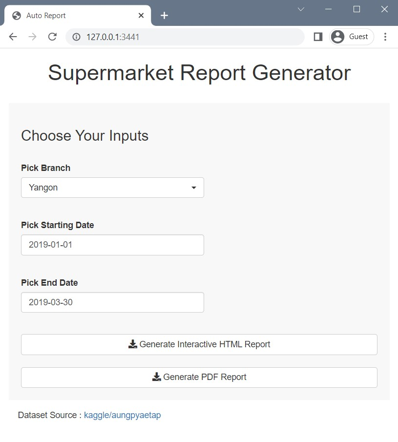
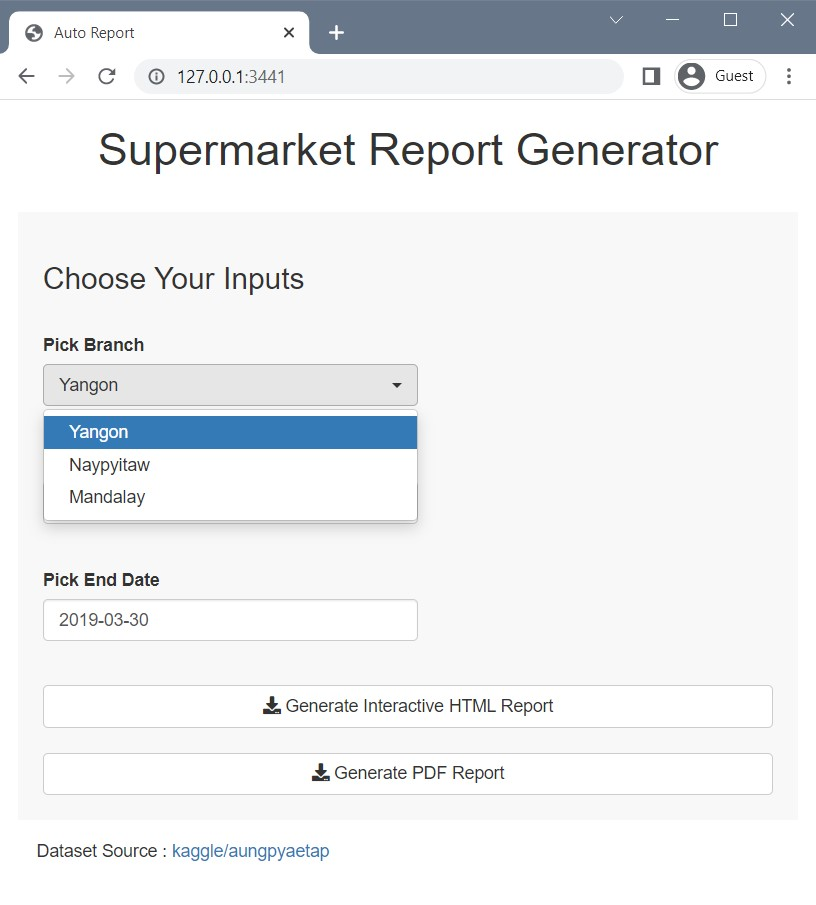
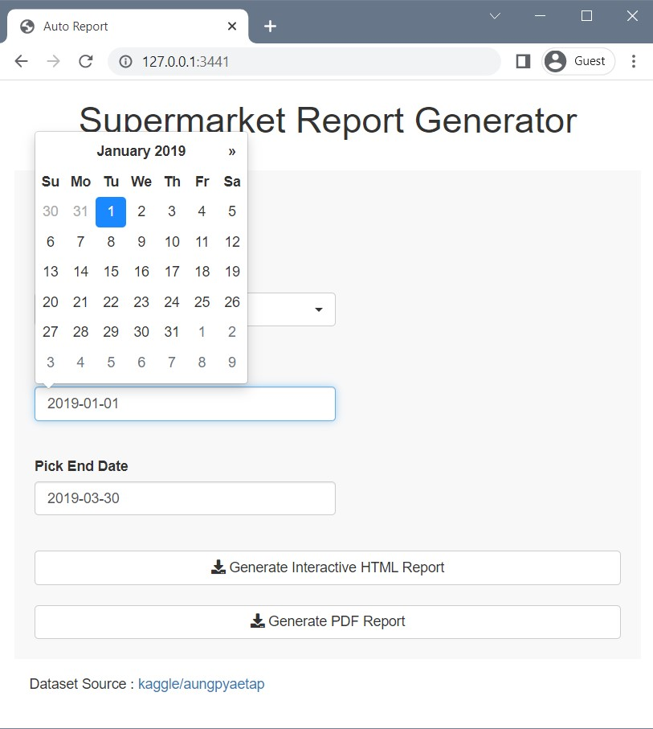

---
output:
  html_document:
    toc: true
    toc_depth: 3
    theme: paper
title: "Automated Reports"
author: "[Devi Annanda](https://dvannanda.github.io/cv/)"
date: "Updated: `r format(Sys.Date(), '%A, %d %B %Y')`"
---

```{r setup, include=FALSE}
knitr::opts_chunk$set(echo = FALSE, warning = FALSE, message = FALSE)

library(tidyverse)
```


Automate your repetitive reports! 

## Screenshots







### See the output of template1 [here](template/template1.html)

## Features

- Complete template customization.
- Multiple templates from one or multiple datasets. 
- Multiple output formats: html (for interactive reports), pdf, presentation slides or word documents.
- Dataset sources: CSV, Excel, and JSON.
- Interactive charts with plotly! (See [gallery](https://plotly.com/r/), HTML outputs only.)
- Maximize reproducability in your reports - reduce human errors especially in processes that require long data manipulation and calculations.
- Based on open source software.

## Graphs Gallery in R - some examples

- [ggplot gallery](https://www.r-graph-gallery.com/)
- [plotly interactive charts gallery](https://plotly.com/r/)

## Sample Data: Supermarket Sales
